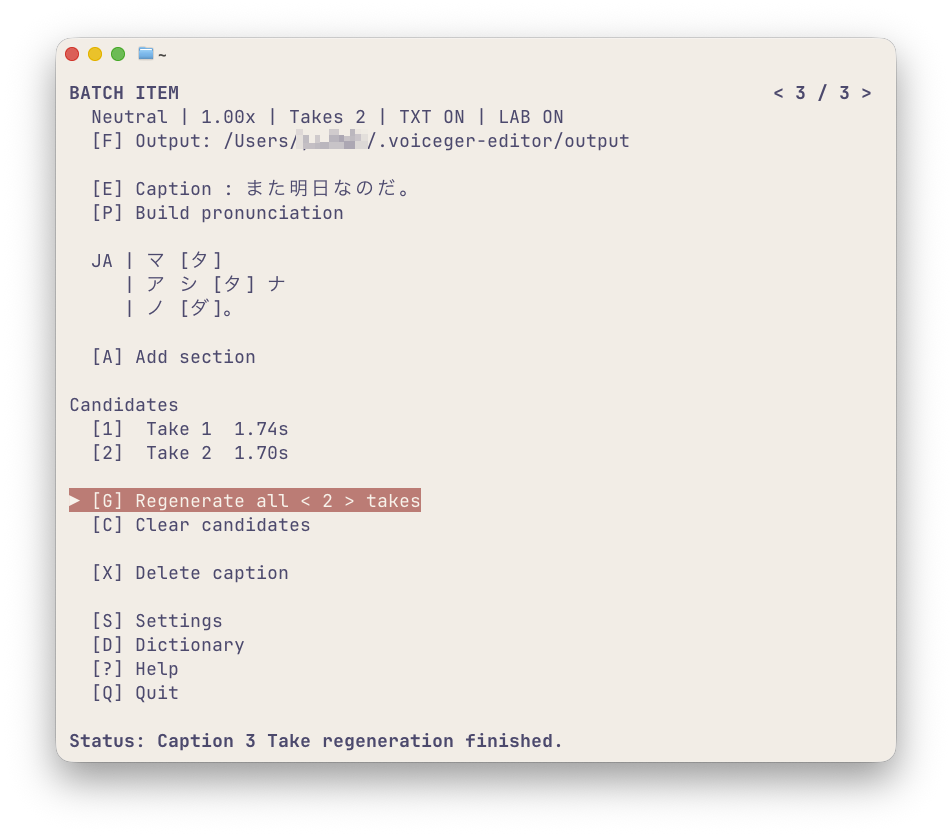
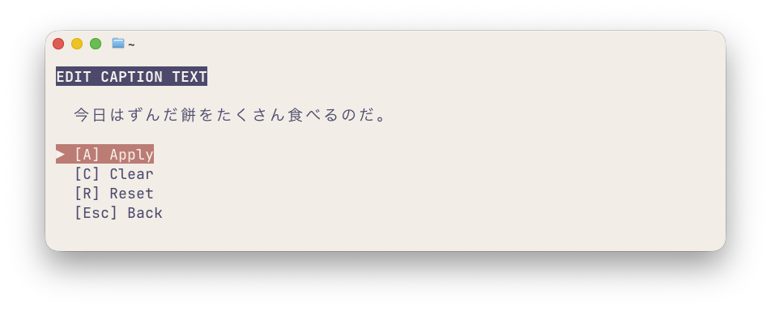
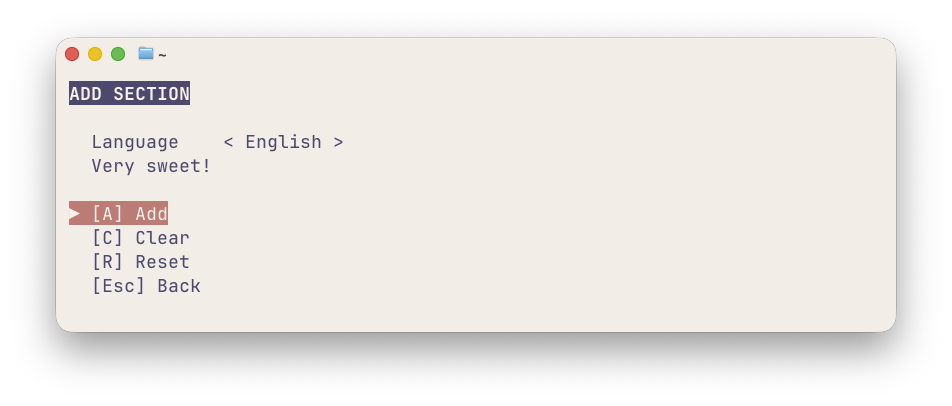
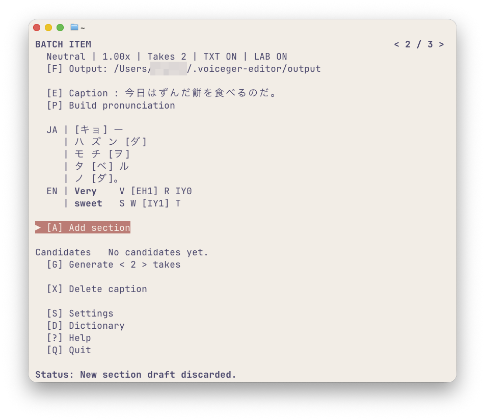
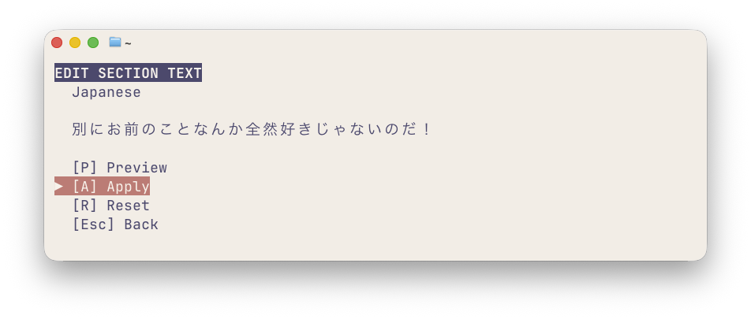
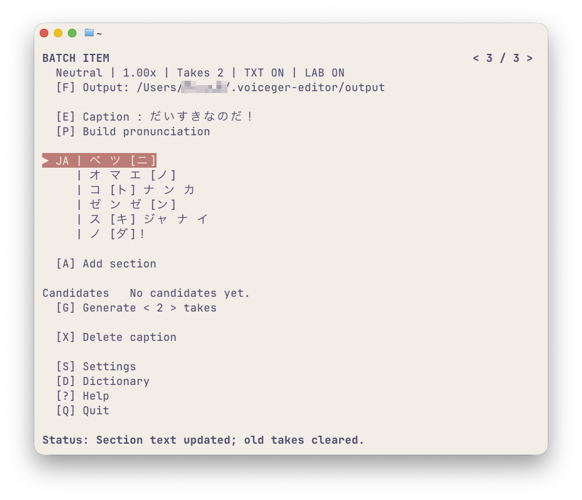
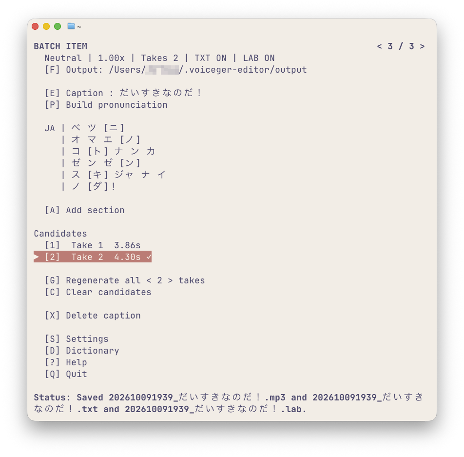
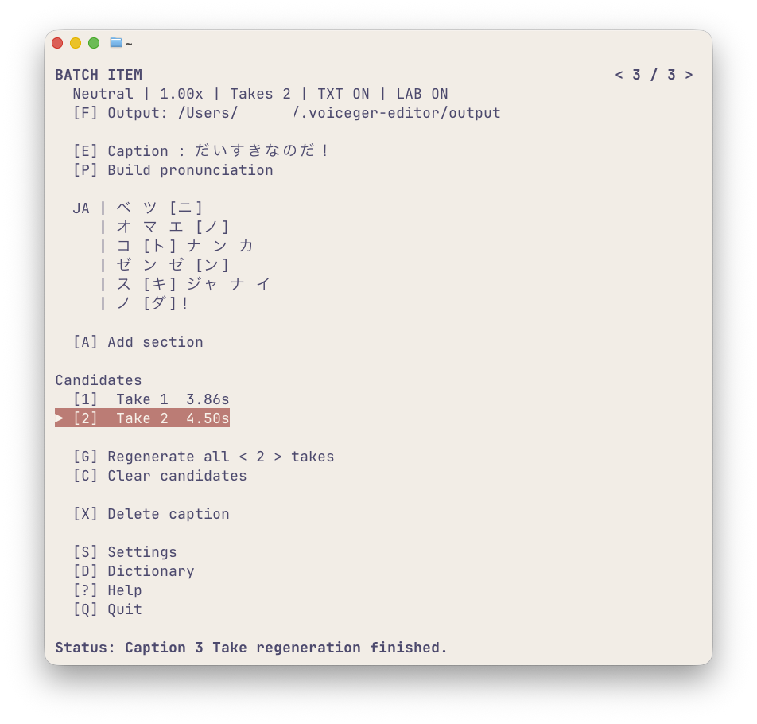
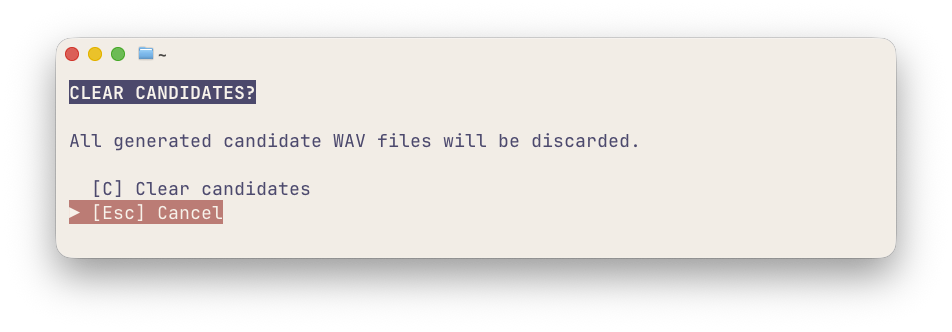
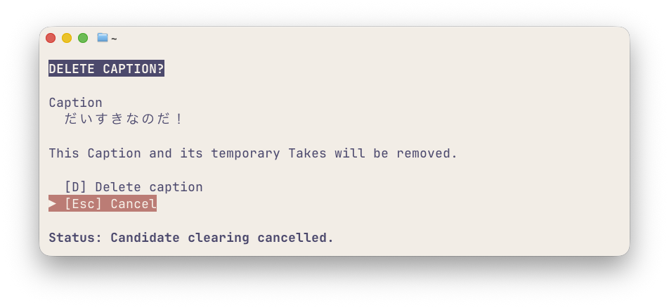

# BATCH ITEM

`BATCH ITEM` は、`BATCH LIST` に登録した Caption を1件ずつ開き、文章・発音・セクション・Takeを操作する画面です。

Captionの登録と一括生成は [BATCH LIST](batch-list.md)、Takeの生成・再生・採用の基本操作は [はじめての音声生成](tui.md) を参照してください。

## 画面の見方

今回は、次の3件のCaptionがBATCH LISTに登録されている状態を例にします。

```text
おはようなのだ。
今日はずんだ餅を食べるのだ。
また明日なのだ。
```

3番目の「また明日なのだ。」を開き、Takeを2本生成した画面です。



| 項目 | 内容 |
|---|---|
| `< 3 / 3 >` | 現在開いているCaptionの位置 |
| 画面上部の設定概要 | Style、Speed、Take数、TXT・LABの出力状態 |
| `[F] Output` | 音声ファイルの保存先 |
| `[E] Caption` | ファイル名やTXT出力に使う文章 |
| `[P] Build pronunciation` | Captionから発音情報を再作成 |
| `JA` / `EN` | 実際に読み上げる日本語・英語の発音情報 |
| `[A] Add section` | 読み上げるセクションを追加 |
| `Candidates` | 生成したTakeの一覧 |
| `[G] Generate` | Takeを生成・再生成 |

Up / Downで項目を移動できます。Tab / Shift+Tabでは主要な項目間を移動できます。

## Caption間を移動する

`BATCH ITEM` を開いたまま、`[` で前、`]` で次のCaptionへ移動できます。

タイトル行の位置表示にフォーカスを合わせた場合は、Left / Rightでも移動できます。先頭と末尾でループはしません。

Escで`BATCH LIST`に戻ります。

## Captionの文章を編集する

`[E] Caption` では、登録済みのCaptionの文章を変更できます。

今回は2番目のCaptionを次のように変更します。

変更前：

```text
今日はずんだ餅を食べるのだ。
```

変更後：

```text
今日はずんだ餅をたくさん食べるのだ。
```

1. `BATCH ITEM 2/3` で`E`を押し、`EDIT CAPTION TEXT`を開きます。
2. 文章を変更し、Enterで編集を終了します。
3. `[A] Apply` を実行します。



`[C] Clear` は編集中の文章を空にし、`[R] Reset` は編集開始時の文章に戻します。Escでは変更を破棄します。

**Captionを変更しても、既存の発音情報やTakeはクリアされません。**

Captionはファイル名やTXT出力に使用する情報として、実際の読み上げ内容とは独立して編集できます。

Caption変更に合わせて読み上げ内容も変更したい場合は、該当するセクションの文章を編集するか、`[P] Build pronunciation` でCaptionから発音情報を再作成してください。

## セクションを追加する

`[A] Add section` では、日本語または英語のセクションを読み上げ内容の末尾に追加できます。

ここでは、2番目のCaptionに英語の `Very sweet!` を追加します。以下の追加例は、先ほどのCaption編集例とは独立した操作例です。

1. `BATCH ITEM` で`A`を押し、`ADD SECTION`を開きます。
2. `Text` に `Very sweet!` を入力し、Enterで編集を終了します。
3. `Language` にフォーカスを合わせ、Left / Rightで `English` を選択します。
4. `[A] Add` を実行します。



成功すると、元の日本語セクションの後に英語の発音情報が表示されます。



この画面では、`JA` に日本語のアクセント、`EN` に `Very` と `sweet` のARPAbetが表示されています。英語の発音は追加時に自動作成され、あとから編集できます。

**セクションを追加すると、既存のTakeはクリアされます。** 読み上げる内容が変わったため、必要に応じて再生成してください。

### セクションを削除する

日本語・英語のどちらも、発音行を選択してEnterで`EDIT PRONUNCIATION`を開き、`[X] Delete section`から削除できます。

削除前には`DELETE SECTION?`が表示され、対象セクションの全文を確認できます。`[D] Delete`で確定、Escでキャンセルします。削除対象は選択したアクセント句・単語だけではなく、**そのセクション全体**です。

最後の1セクションは削除できません。削除するとCaptionは維持されますが、既存のTakeはクリアされます。

## セクションとCaptionの違い

Captionとセクションには、別々の文章を設定できます。

これは、動画編集で**字幕と音声の内容を変えたい場合**などに便利です。例えば、キャラクターが本心とは違うことを話している場面を考えます。

**字幕（Caption）**

```text
だいすきなのだ！
```

**実際に読み上げる文章（日本語セクション）**

```text
別にお前のことなんか全然好きじゃないのだ！
```

このような場合は、Captionに「だいすきなのだ！」を設定し、日本語の発音行から`[E] Edit text`を開いて、実際に読み上げる文章を変更します。



変更をApplyした後の`BATCH ITEM`では、Captionは「だいすきなのだ！」のまま、発音情報は別のセリフに対応する内容になっています。



`[A] Add section` は新しい読み上げ内容を末尾に追加する操作です。既存セクションの文章を置き換えたい場合は、`Edit text` を使用してください。

### 出力されるTXTとファイル名

TXT出力を有効にしてTakeを採用すると、音声ファイルと一緒に、**Captionと同じ内容のTXTファイル**が保存されます。

上の例で出力されるTXTの内容は次のとおりです。

```text
だいすきなのだ！
```

音声では別のセリフを読み上げても、ファイル名とTXTには**採用時点のCaption**が使用されます。



この画像ではTake 2が採用され、画面下部のStatusにMP3・TXT・LABの保存ファイル名が表示されています。出力される形式と追加ファイルは設定によって異なります。

このように、**Captionを字幕用、セクションを音声用として使い分けることができます。**

## 発音情報を再作成する

`[P] Build pronunciation` では、現在のCaptionから発音情報を作り直せます。

Captionを編集しただけでは、読み上げる文章や発音情報は自動的に変わりません。Captionの変更を読み上げにも反映したい場合に、`Build pronunciation`を実行します。

手動で調整した発音情報や追加したセクションがある場合は、再作成によって上書きされます。必要に応じて確認画面が表示されます。

**発音情報を再作成すると、既存のTakeと採用状態はクリアされます。** 一部の読みやアクセントだけを直したい場合は、該当する発音行を編集してください。

## Takeを再生成する

生成済みのTakeは、1本だけ再生成することも、まとめて再生成することもできます。

### 1本だけ再生成する

今回は、2本あるTakeのうちTake 2だけを再生成します。

1. `Candidates` からTake 2にフォーカスを合わせます。
2. `r`を押します。
3. 再生成の完了を待ちます。



撮影例ではTake 1が **3.86秒のまま**、Take 2が **4.30秒から4.50秒** に変わっています。Take 1は維持され、Take 2だけが置き換わりました。

採用済みのTakeを再生成すると、その採用状態は解除されます。別のTakeが採用済みであれば、その採用状態は維持されます。

すでにOutputへ保存したファイルは、再生成しても削除されません。

### すべて再生成する

生成済みのTakeがあると、`[G] Generate` は `[G] Regenerate all` に変わります。

この操作では現在の候補をすべて置き換え、採用状態も解除します。`Regenerate all`の行にフォーカスを合わせてLeft / Rightを押すと、次回生成するTake数を変更できます。

Take数だけを変更しても、その時点では既存の候補は削除されません。

## Takeを整理する

### すべての候補を削除する

`[C] Clear candidates` は、現在のCaptionの生成済み候補をすべて削除する操作です。

`C`を押すと確認画面が表示されます。



`[C] Clear candidates`で削除を確定し、Escでキャンセルできます。削除すると候補と採用状態がクリアされますが、**すでにOutputへ保存した音声・TXTなどのファイルは削除されません**。

### Takeがクリアされる操作

| 操作 | 既存のTake |
|---|---|
| Captionの文章を変更 | 維持 |
| セクションの文章を変更 | クリア |
| 発音・アクセントを変更 | クリア |
| `Add section` / `Delete section` | クリア |
| `Build pronunciation` | クリア |
| 音声生成パラメーターを変更 | クリア |
| Take数のみを変更 | 維持 |

Takeの再生・採用の基本操作は [はじめての音声生成](tui.md) を参照してください。

## Captionを削除する

`[X] Delete caption` は、現在のCaptionを`BATCH LIST`から削除する操作です。

`X`を押すと、削除対象と注意事項を表示した確認画面が開きます。



`[D] Delete caption`で確定すると、そのCaptionと一時的なTakeが削除され、`BATCH LIST`に戻ります。

Escでキャンセルした場合、CaptionとTakeは維持されます。すでにOutputへ保存したファイルは削除されません。

## その他の操作

| キー | 操作 |
|---|---|
| `1`〜`9` | 対応するTakeへ移動して再生 |
| `0` | Takeが10本以上ある場合に番号を指定 |
| Space | 選択中のTakeを再生 |
| `F` | Outputの保存先を直接編集 |
| `S` | Settingsを開く |
| `D` | Dictionaryを開く |
| `?` | Helpを開く |
| Esc | BATCH LISTに戻る |

音声生成は同時に1つだけ実行できます。保存先や音声形式などの設定は [設定](settings.md) を参照してください。

## 関連ドキュメント

- [はじめての音声生成](tui.md) — Takeの生成・再生・採用
- [BATCH LIST](batch-list.md) — 複数Captionの管理と一括生成
- [日本語の発音編集](japanese-pronunciation.md) — 読みとアクセントの編集
- [英語の発音編集（ARPAbet）](arpabet.md) — 音素と強勢の編集
- [設定](settings.md) — 音声生成設定と保存先
