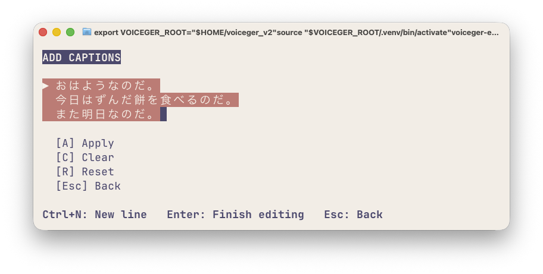
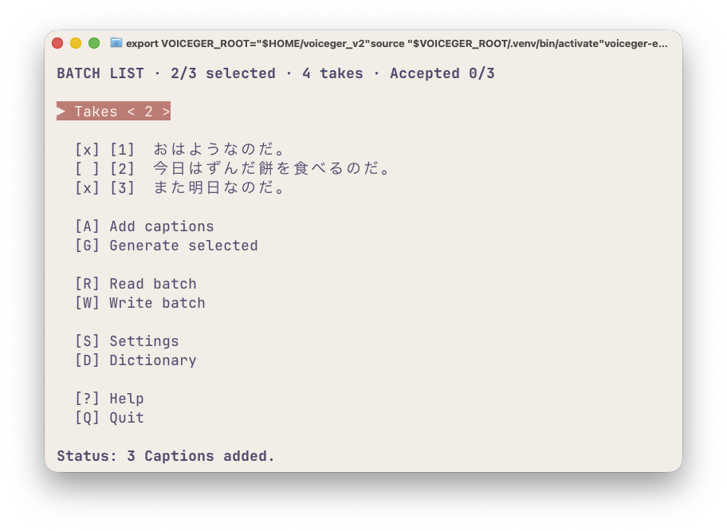
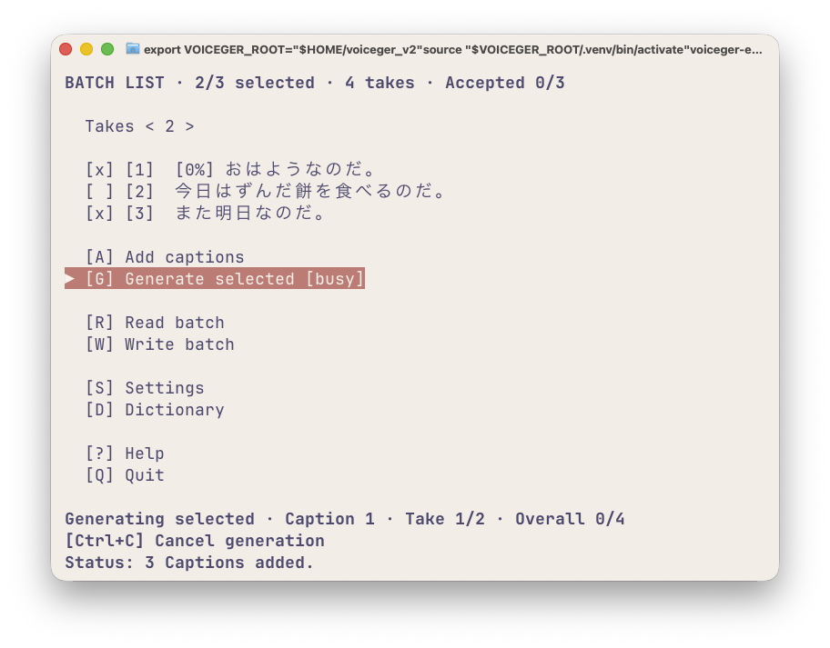
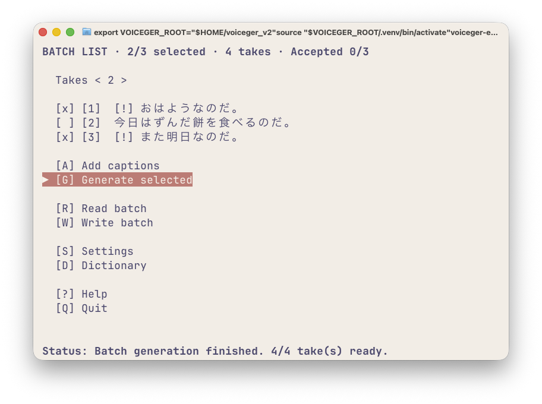
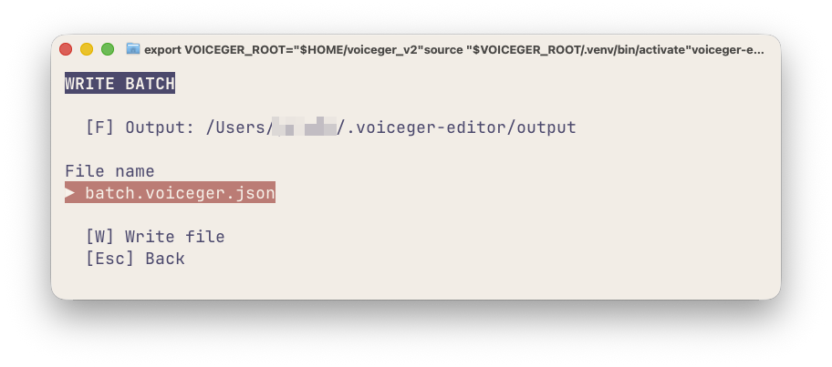
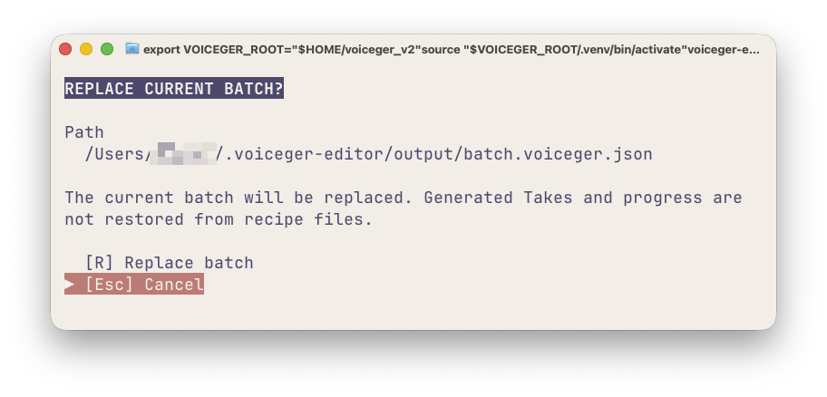

# BATCH LIST

`BATCH LIST` 画面では、複数のCaptionをまとめて管理することができます。

一括生成するCaptionの選択、Take数の設定、バッチファイルの保存・読み込みができます。

Captionを1件ずつ編集して音声を生成する基本操作は、[はじめての音声生成](tui.md)を参照してください。

## 画面の見方

画面上部には、Captionの選択状況と採用状況が表示されます。

```text
BATCH LIST · 2/3 selected · 4 takes · Accepted 0/3
```

| 表示 | 意味 |
|---|---|
| `2/3 selected` | 3件中2件が一括生成の対象 |
| `4 takes` | 一括生成で生成するTakeの合計数 |
| `Accepted 0/3` | 3件中、採用済みのCaptionは0件 |
| `[x]` | 一括生成の対象 |
| `[ ]` | 一括生成の対象外 |

選択の有無は一括生成の対象を決めるものです。対象外にしてもCaptionは削除されず、個別に開いて編集・生成できます。

## 複数のCaptionをまとめて追加する

`[A] Add captions` を開き、次の3行を入力します。

```text
おはようなのだ。
今日はずんだ餅を食べるのだ。
また明日なのだ。
```



複数行の文章をまとめてペーストできます。手入力で改行する場合は `Ctrl+N` を押してください。

Enterで編集を終了し、`[A] Apply` を実行します。

空行を除き、1行につき1件のCaptionが追加されます。

## 一括生成の対象を選択する

追加したCaptionは、初期状態ではすべて一括生成の対象です。

今回は2番目の「今日はずんだ餅を食べるのだ。」を対象外にします。

1. Up / Downで2番目のCaptionにフォーカスを合わせます。
2. Spaceを押して、`[x]` を `[ ]` に切り替えます。
3. `Takes` にフォーカスを移動します。
4. Left / RightでTake数を `2` に設定します。



この状態では、1番目と3番目のCaptionがそれぞれ2 Takeずつ生成されます。

画面上部の表示は次のようになります。

```text
BATCH LIST · 2/3 selected · 4 takes · Accepted 0/3
```

`Takes` は一括生成で使用する標準のTake数です。CaptionごとにTake数が個別指定されている場合は、その指定が優先されます。

## 選択したCaptionを一括生成する

`[G] Generate selected` を実行します。

選択されているCaptionが、一覧の順番に生成されます。

### 生成中

生成中は、処理中のCaptionに進捗率が表示されます。

画面下部には、現在のCaption、Take番号、全体の進捗が表示されます。



生成を中止する場合は `Ctrl+C` を押します。

キャンセルは安全な区切りで処理されるため、進行中のTakeが完了するまで時間がかかる場合があります。すでに生成されたTakeは保持されます。

生成処理は同時に1つだけ実行できます。生成中に別の生成操作を実行しても、追加の処理は開始されません。

### 生成完了後

生成が完了すると、Captionに状態を示す記号が表示されます。



| 表示 | 状態 |
|---|---|
| `[!]` | 生成完了・Takeの確認待ち |
| `[✓]` | Takeを採用済み |
| `[⚠]` | 生成失敗またはキャンセル |
| `[0%]`〜`[100%]` | 生成中の進捗 |

今回、生成対象外にした2番目のCaptionには新しいTakeは生成されません。

生成されたTakeを確認・採用する方法は、[はじめての音声生成](tui.md)を参照してください。

## バッチファイルを保存する

`[W] Write batch` では、現在のCaption一覧と生成設定をバッチファイルとして保存できます。

保存したファイルは、あとから読み込んで同じCaptionの音声を再生成する際に利用できます。

### 保存前の準備

**バッチファイルを保存するには、すべてのCaptionで発音情報の準備が完了している必要があります。**

今回、2番目のCaptionは生成対象外だったため、まだ発音情報が準備されていない場合があります。

その場合は2番目のCaptionを一度開き、発音情報の準備が完了したことを確認してから `BATCH LIST` に戻ってください。

発音情報の編集方法は[発音編集](pronunciation.md)を参照してください。

### 保存手順

1. `BATCH LIST` で `[W] Write batch` を開きます。
2. `Output` に保存先のフォルダが表示されます。
3. `File name` にファイル名を入力します。
4. `[W] Write file` を実行します。



初期ファイル名は次のとおりです。

```text
batch.voiceger.json
```

ファイルは `Output` に表示されているフォルダに保存されます。

`Output` はほかの画面と共通の保存先設定です。保存先の変更方法は[設定](settings.md)を参照してください。

### バッチファイルに保存される内容

バッチファイルには、Caption、発音情報、一括生成の対象設定、Take数、音声生成に必要な設定などが保存されます。

一方、**生成済みTakeや採用状態は保存されません。**

バッチファイルは音声生成の作業内容を保存するものであり、生成途中の状態を再開するためのファイルではありません。

ファイル形式はJSONです。テキストエディターで内容を確認・編集できます。

## バッチファイルを読み込む

`[R] Read batch` では、保存したバッチファイルからCaption一覧を復元できます。

1. `BATCH LIST` で `[R] Read batch` を開きます。
2. `File path` に読み込むファイルのパスを入力します。
3. `[R] Read file` を実行します。

`File path` の初期値には、現在のOutputフォルダが表示されます。

たとえば、先ほど保存した `batch.voiceger.json` を指定できます。

### 既存のCaptionがある場合

現在の `BATCH LIST` にCaptionが存在する場合、置き換え確認が表示されます。



`[R] Replace batch` を実行すると、現在のCaption一覧が読み込んだ内容に置き換わります。

`Esc` でキャンセルした場合、現在のCaption一覧は変更されません。

読み込んだバッチにはCaptionと発音情報、生成設定などが復元されますが、生成済みTakeや採用状態は復元されません。必要に応じてTakeを再生成してください。

## その他の操作

### Captionを直接開く

Captionの番号が1〜9の場合は、対応する数字キーで直接開けます。

10件以上ある場合は `0` を押すと、番号入力が表示されます。目的の番号を入力し、Enterで開いてください。

### Captionを削除する

削除するCaptionにフォーカスを合わせ、`x` キーを押します。

確認画面で削除を確定すると、そのCaptionが一覧から削除されます。

### BATCH ITEMに移動する

Captionを選択してEnterを押すと、`BATCH ITEM` が開きます。

Captionの編集、個別生成、Takeの再生成などについては、[BATCH ITEM](batch-item.md)を参照してください。
