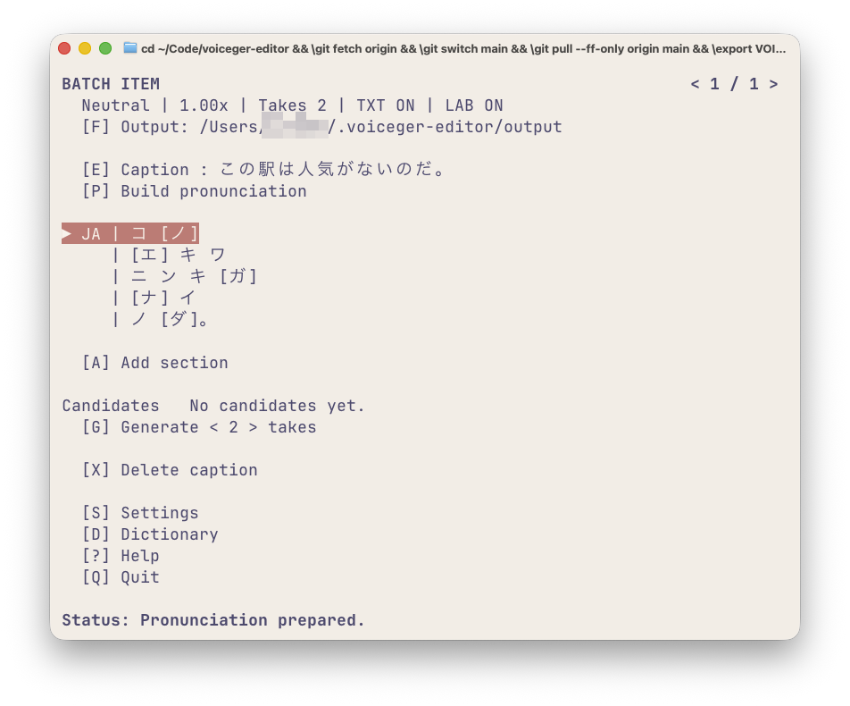
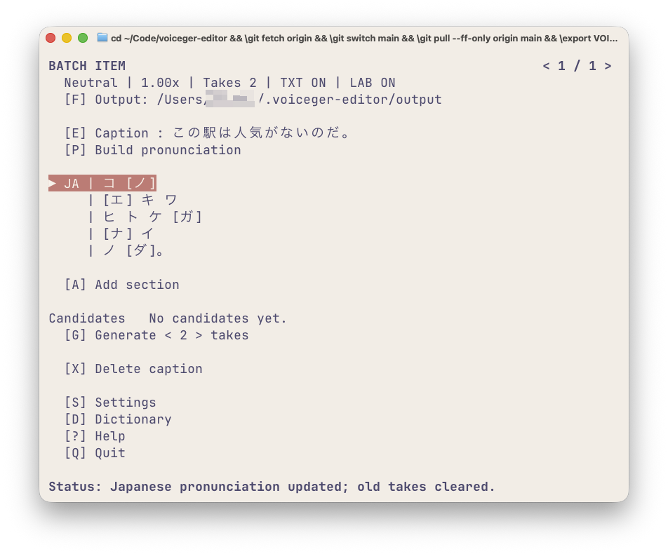

# 日本語の発音編集

Voiceger Editorでは、日本語の読みやアクセントを編集できます。

例えば、同じ「アメ」でも「雨」と「飴」ではアクセントが異なります。また、漢字の読みが意図したものと違っている場合にも、発音情報を修正できます。

ただし、実際に生成される音声が必ずしも指定どおりになるとは限りません。Previewで発音を確認しながら調整してください。

## 読みとアクセント

### 読みを修正する

同じ漢字でも、文脈や意図によって読み方が変わることがあります。

例えば、次の文章：

> この駅は人気がないのだ。

「人気」は、「にんき」と「ひとけ」のどちらとも読めます。



自動変換で「ニンキ」と変換された場合でも、`EDIT PRONUNCIATION` 画面から「ヒトケ」に手動で変更できます。



具体的な操作方法は、[はじめての音声生成：アクセント句の区切りを変更](tui.md#4-アクセント句の区切りを変更)を参照してください。

### アクセントを修正する

日本語には、読みが同じでもアクセントが異なる言葉があります。

例えば「雨」と「飴」です。

| 単語 | 発音 |
|---|---|
| 雨 | `ア'メ` |
| 飴 | `アメ'` |

`'` はアクセントの位置を示す記号です。

アクセント位置を変更することで、同じ読みでも異なるアクセントを指定できます。

具体的な操作方法は、[はじめての音声生成：アクセント位置を変更](tui.md#3-アクセント位置を変更)を参照してください。

## 発音の表記ルール

### モーラとアクセント記号

日本語のアクセントは、モーラ単位で指定します。

モーラとは、日本語の音の長さを数える単位です。

例えば「ずんだもん」は、次の5モーラからなります。

```text
ズ・ン・ダ・モ・ン
```

アクセント記号 `'` は、アクセントを指定するモーラの直後に置きます。

```text
ズ'ンダモン
```

この例では、最初の「ズ」にアクセントを指定しています。

小さい「ャ」「ュ」「ョ」などは、直前の仮名と合わせて1モーラとして扱います。

例えば「キャ」は2文字で1モーラです。

```text
キャ'ク
```

長音記号「ー」は1モーラとして数えます。

ひらがなとカタカナのどちらでも入力できます。

### アクセント句の区切り

日本語の発音は、複数のアクセント句に分かれることがあります。

アクセント句とは、1つのアクセントを持つまとまりです。

`EDIT PRONUNCIATION` では、アクセント句をスペースで区切ります。

```text
キョ'ーワ ア'メデスネ。
```

それぞれのアクセント句には、アクセント記号 `'` が1つ必要です。

半角スペースと全角スペースの両方を使用できます。

なお、アクセント句の区切りは、発話の間やリズムを直接指定するものではありません。

### 句読点

次の句読点を使用できます。

```text
。 、 ？ ！ …
```

半角の `. , ? !` を入力した場合は、対応する全角の句読点に変換されます。

## 編集画面の機能

### PreviewとApply

**Preview** は、編集中の発音を一時的に音声生成して確認する機能です。

Previewを実行しても、現在の発音情報は変更されません。また、通常のTakeも作成されません。

**Apply** は、編集した発音を確定する操作です。

発音を変更すると、既存のTakeはクリアされます。詳しくは[BATCH ITEM](batch-item.md)を参照してください。

### ClearとReset

**Clear** は、編集中の発音欄を空にします。

**Reset** は、編集画面を開いたときの発音に戻します。

どちらも、その操作だけでは現在の発音情報を変更しません。

Resetは、文章から発音を自動生成し直す操作ではありません。

## 関連ドキュメント

- [はじめての音声生成](tui.md) — アクセント位置の変更と発音編集の基本操作
- [BATCH ITEM](batch-item.md) — セクションの編集、発音情報の再作成、Takeの管理
- [英語の発音編集（ARPAbet）](arpabet.md) — 英語の音素と強勢の編集
- [ユーザー辞書](dictionary.md) — 発音の辞書登録と管理
