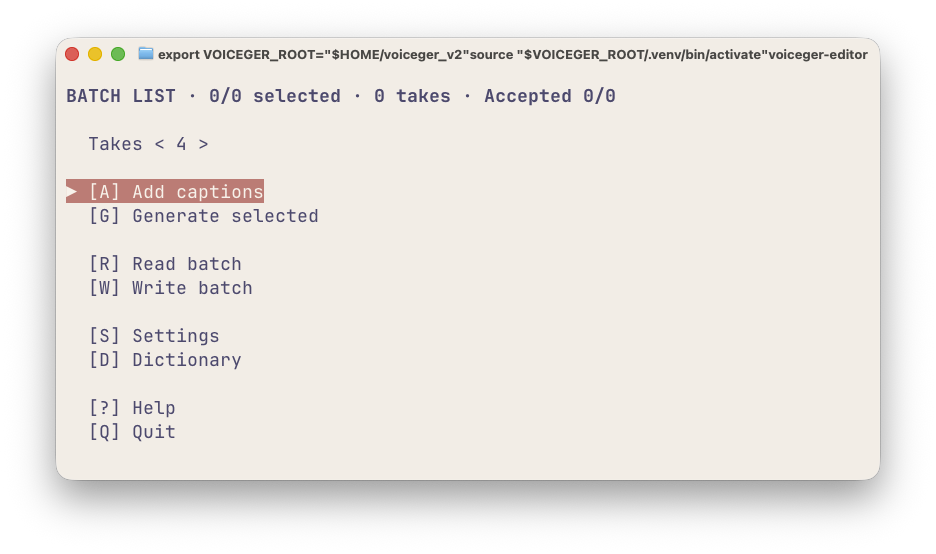
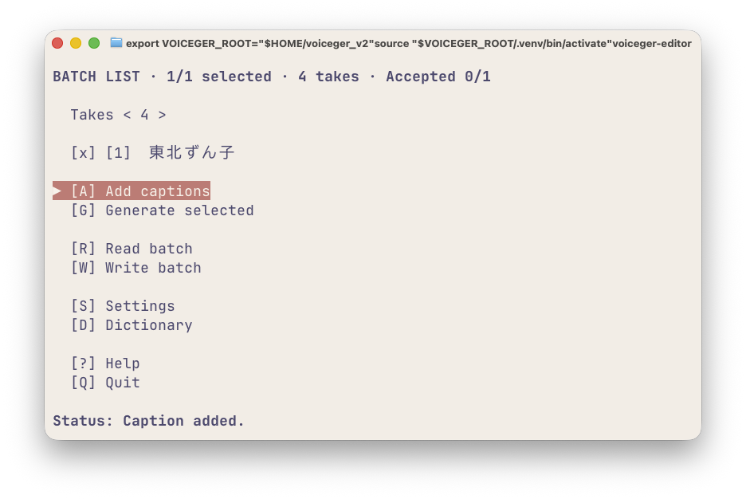
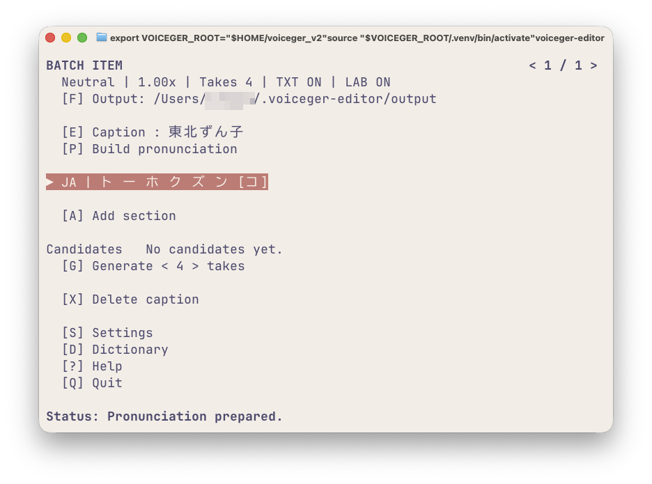
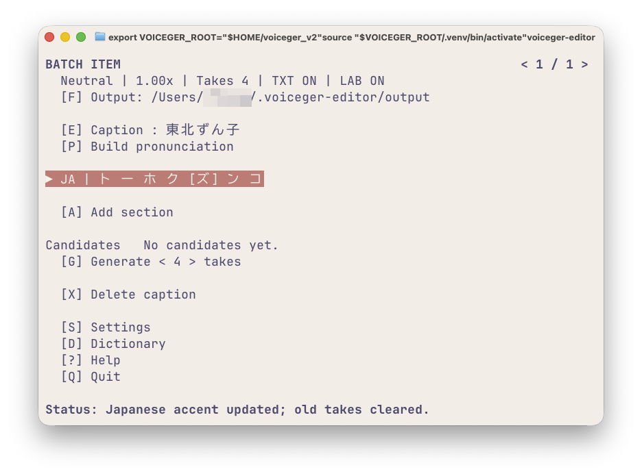
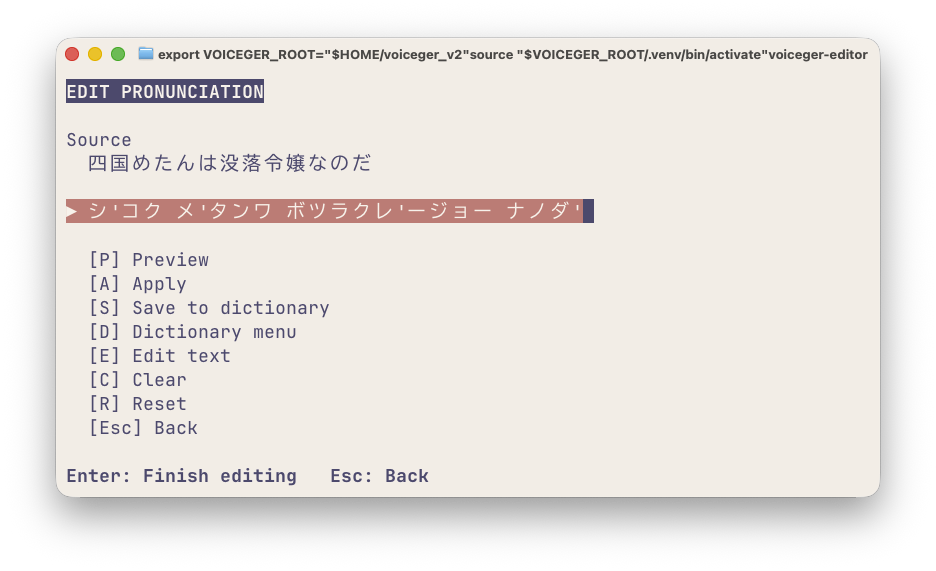
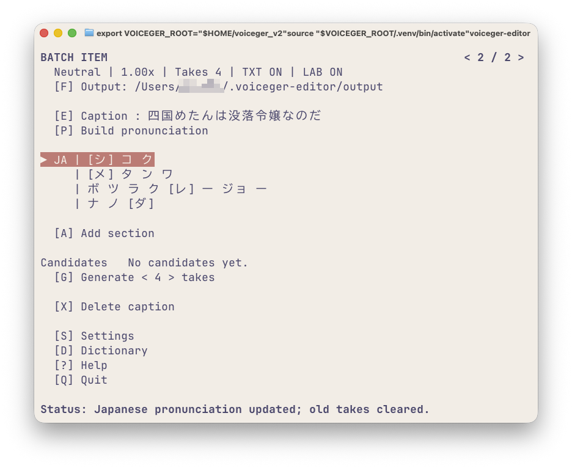
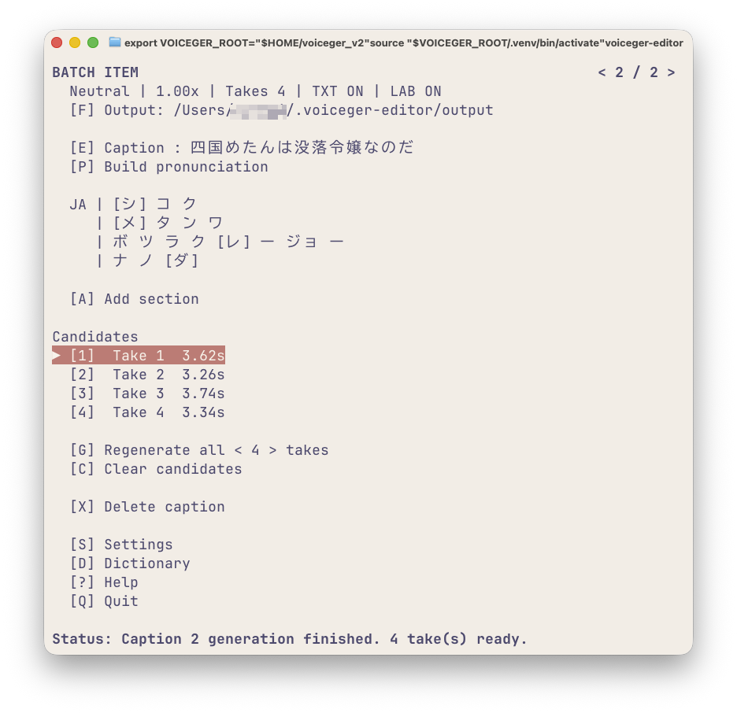
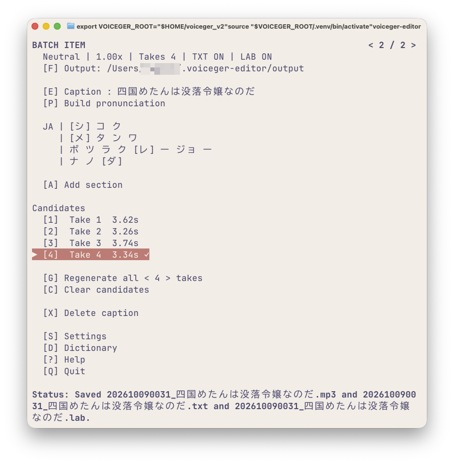
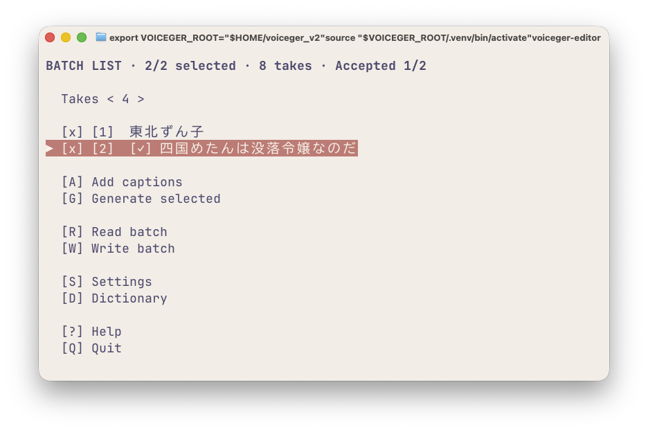

# はじめての音声生成

Voiceger Editor で Caption を追加し、発音を調整して、Take を生成・保存するまでの基本操作です。

Voiceger Editor では、音声にする文章を **Caption**、Caption から生成した候補音声を **Take** と呼びます。

## 1. 起動

Voiceger の Python 環境を有効にして、Voiceger Editor を起動します。

```bash
voiceger-editor
```

起動すると `BATCH LIST` 画面が表示されます。



## 2. Caption を追加

`[A] Add captions` を開き、次の文章を入力します。

```text
東北ずん子
```

Enter で入力を終了し、`[A] Apply` を実行します。

`BATCH LIST` に Caption が追加されます。



追加した Caption を選択して Enter を押すと、`BATCH ITEM` が開きます。

## 3. アクセント位置を変更

Caption を開くと、発音情報が自動的に作成されます。

「東北ずん子」の自動変換結果は次のとおりです。

```text
▶ JA | ト ー ホ ク ズ ン [コ]
```



`[]` で囲まれたモーラがアクセント位置です。

発音行にフォーカスを合わせて Left キーを2回押し、アクセント位置を「コ」から「ズ」に移動します。

```text
▶ JA | ト ー ホ ク [ズ] ン コ
```



Left / Right キーで、アクセント位置を1モーラずつ移動できます。

## 4. アクセント句の区切りを変更

Esc で `BATCH LIST` に戻り、次の Caption を追加します。

```text
四国めたんは没落令嬢なのだ
```

追加した Caption を開き、日本語の発音行を選択して Enter を押します。

`EDIT PRONUNCIATION` が開きます。


自動変換された発音は次のとおりです。

```text
シコクメ' タ'ンワ ボツラクレ'ージョーナ ノダ'
```

スペースはアクセント句の区切り、`'` はアクセント位置を表します。

次のように編集します。

```text
シ'コク メ'タンワ ボツラクレ'ージョー ナノダ'
```



Enter で編集を終了し、`[A] Apply` を実行します。

`BATCH ITEM` の表示が次のように変わります。

```text
JA | [シ] コ ク
   | [メ] タ ン ワ
   | ボ ツ ラ ク [レ] ー ジョ ー
   | ナ ノ [ダ]
```



読みやアクセントの修正、発音表記のルールについては、[日本語の発音編集](japanese-pronunciation.md)を参照してください。

## 5. Take を生成

`[G] Generate` を実行します。

初期設定では4 Takeを生成します。

生成が完了すると、`Candidates` に Take が表示されます。



生成済みの Take がある場合、`[G] Generate` は `[G] Regenerate all` に変わります。

## 6. Take を再生

Up / Down で Take にフォーカスを移動すると、その Take が再生されます。

Space でフォーカス中の Take を再生できます。

`1`〜`9` の数字キーでも、対応する Take に直接移動して再生できます。

## 7. Take を採用

採用する Take にフォーカスを合わせて Enter を押します。

採用した Take には `✓` が表示されます。



採用した音声は、現在の Output フォルダに保存されます。

このスクリーンショットでは、MP3、TXT、LAB の出力が有効になっています。保存形式や追加ファイルは設定によって異なります。

保存先や音声形式については [設定](settings.md) を参照してください。

Take を採用しても、ほかの候補は残ります。

## 8. BATCH LIST に戻る

Esc で `BATCH LIST` に戻ります。

採用済みの Caption には `[✓]` が表示されます。



画面上部の `Accepted 1/2` は、2件の Caption のうち1件で Take が採用されていることを表します。

## 関連ドキュメント

- [BATCH LIST](batch-list.md) — Caption の追加、一括生成、バッチファイルの読み書き
- [BATCH ITEM](batch-item.md) — Take の再生成、Caption の削除などの個別操作
- [日本語の発音編集](japanese-pronunciation.md) — 読み・アクセント・アクセント句の表記ルール
